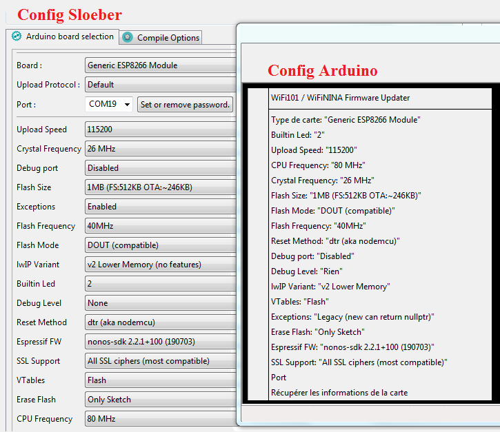
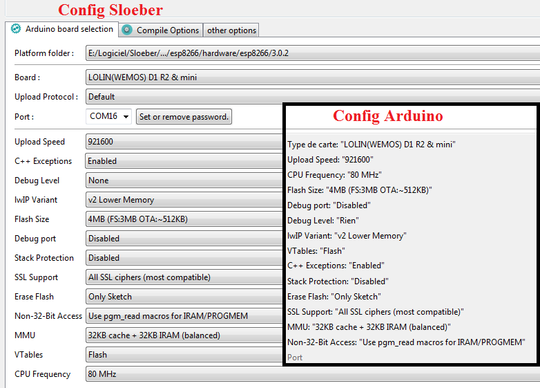

# ESP_Template

---
### Utilisation
Pour créer un nouveau projet sans avoir à tout redéfinir, le plus simple est d'utiliser le projet Template. En effet, les projets ont tous plus ou moins la même structure (Wifi, UART, Display, LittleFS, Communication, ...). Il suffit ensuite de rajouter les éléments spécifiques du nouveau projet.
- Ouvrir le projet ESP_Template
- Faire un clean project
- le dupliquer : click droit copier/coller en donnant un nom au nouveau projet
- fermer le projet ESP_Template
- sélectionner le nouveau projet
- renommer ESP_Template.ino avec le nouveau nom
- fermer le nouveau projet
- avec un éditeur texte, ouvrir le fichier ".cproject" du nouveau projet
- remplacer tous les "ESP_Template" par le nom du nouveau projet
- enregistrer et fermer
- rouvrir le nouveau projet dans Sloeber
- faire un "clean project" et supprimer le contenu du dossier "Release"
- faire un "Build project" du projet. Recommencez si le build plante (en général 3 fois)
- éventuellement, faire un rebuild de l'Index

---
### Adaptation pour ESP-01, ESP-07 ou ESP-12F
**Propriétés du projet/Sloeber onglet "Arduino Board Selection"** 
- Pour ESP-01
  - Board : Generic ESP8266 Module
  - Upload speed : 115200 ou plus
  - Flash size : 1MB (FS:512KB OTA:~246KB)
  - Port : suivant USB 

  
- Pour ESP-07, ESP-12F
  - Board : LOLIN(WEMOS) D1 R2 & mini
  - Upload speed : 115200 ou plus
  - Flash size : 4MB (FS:3MB OTA:~512KB)
  - Port : suivant USB 

 Normalement ça devrait compiler !

---
### Création du filesystem LittleFS (dossier Data)
Faut utiliser Arduino car c'est pas disponible dans Sloeber. 
Dans Arduino, ajouter le plugin <a href="https://github.com/earlephilhower/arduino-esp8266littlefs-plugin">https://github.com/earlephilhower/arduino-esp8266littlefs-plugin</a> 
Une fois les fichiers web mis dans le dossier data, executer "Outils/ESP8266 littleFS Data Upload" 
Regarder dans le log la première ligne commençant par "[LittleFS] upload " : il y a le chemin vers le fichier bin créé. 
Reste plus qu'à uploader le bin 
- Pour ESP-01
  - Adresse Bin en 7B000
- Pour ESP-12F
  - Adresse Bin en 0x100000

---
### Exemple Log ESP01 :

------------------------------
ESP Flash and Sketch info
------------------------------
Flash real id:   001440E0 
Flash real size: 1048576 bytes (1.00 Mo) 
 
Flash ide  size: 1048576 bytes (1.00 Mo) 
Flash ide speed: 40 MHz 
Flash ide mode:  DOUT 
Flash Chip configuration ok. 
 

Sketch size: 410048 bytes (400.44 ko) 
Sketch free space: 90112 bytes (88.00 ko) 

------------------------------
File system info
------------------------------
Total space:	524288 bytes (512.00 ko) 
Total space used:	65536 bytes (64.00 ko) 
Free space:	458752 bytes (448.00 ko) 
Block size:	8192 bytes (8.00 ko) 
Block number:	64 
Page size:	524288 bytes (512.00 ko) 
Max open files:	5 
Max path lenght:	32 

------------------------------
List files
------------------------------
	FS Enter Dir: / 
	FS File: ESPTemplate.css, size: 2.24 ko, time: 1638121243 
	FS File: ESPTemplate.js, size: 5.87 ko, time: 1638278089 
	FS File: FileSaver.min.js, size: 2.63 ko, time: 1601994956 
	FS File: favicon.ico, size: 894.00 o, time: 1601303742 
	FS File: index.html, size: 2.30 ko, time: 1638199212 
	FS File: log.txt, size: 429.00 o, time: 41 
 
****** Starting ****** 
 
Connecting to SSID 
password 
............. 
WiFi connected. 
IP address:  
IP=192.168.59.118 

