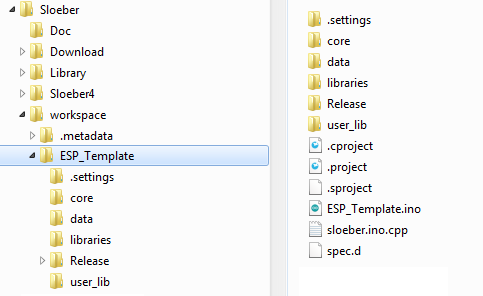
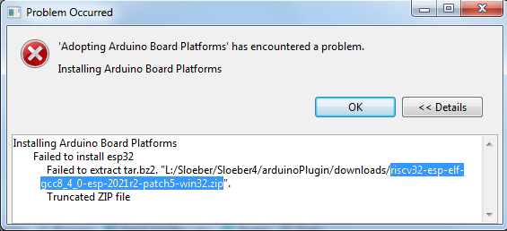

# Installation Sloeber

---
### Installation
Télécharger Sloeber V4.4.3 (Béryllium) version bundle : <a href="http://eclipse.baeyens.it/stable.php?OS=Windows" target="_blank">http://eclipse.baeyens.it/stable.php?OS=Windows</a>

Pour simplifier, j'ai créé un dossier C:\Sloeber (noté DIR pour la suite) pour le programme, mes librairies et le workspace. 
Tous les chemins seront donc relatif à cet emplacement. A adpater suivant la configuration.

NOTE : En cas de ré-installation, renommer C:\Sloeber en C:\Sloeber_old. Créer un nouveau C:\Sloeber et déplacer dedans les dossiers Doc et Library mais pas le workspace (en créer un nouveau). A la fin, on importera les anciens projets dans le nouveau workspace.

- Dézipper le fichier dans DIR. Renommer le dossier Sloeber créé en <b>Sloeber4</b>
- Lancer sloeber-ide.exe
- Définir un workspace : DIR\workspace et cocher la case "Use this as default ..."
- Attendre qu'il termine de télécharger les packages : c'est long ! (Finishing the installation en bas à droite)
- Au démarrage, fermer la page "Welcome" si existe sinon ouvrir la perspective C/C++ (en haut à droite)
- Menu "Window/Preferences/General/Workspace/Linked Resources"
  - Cocher "Enable linked resources"
  - Ajouter la variable USER_LIB : DIR\Library
  - Apply and close 

Note : un tutoriel de Sloeber <a href="https://github.com/ArminJo/SloeberTutorial" target="_blank">https://github.com/ArminJo/SloeberTutorial</a> 

Au final on aura une arborescence de ce style avec comme exemple le projet ESP_Template. 
 

---
### Réglage préférences style
Pour conserver le même style dans tous les fichiers : 
- Windows/Preference/General/Workspace : sélectionner UTF-8 pour Text file encoding (sinon problème d'accent dans les fichiers)
- Window/Preferences/General/Workspace/Build : Cocher la case "Save automatically before manual build" (ça évite bien des erreurs !!)
- Windows/Preference/General/Editors/Text Editors/Spelling : disable spel checking
- Windows/Preference/General/Editors/Text Editors :
  - tab width : 2
  - insert space for tabs
  - show line number	
- Windows/Preference/"C/C++"/Code Style/Formatter : 
  - Importer le profil "ESP_profil_formatter.xml"

---
### Réglage projet
- Project/Properties/"C/C++ Build"/Behavior : 
  - Enabled parallel build
- Option de compilation des warning
  - Pour Custom, mettre -Wall -Wextra -Wno-unused-variable

---
### Divers trucs utiles pour Sloeber
- Pour supprimer l'attente de mise à jour au démarrage du programme, aller dans le menu Sloeber/Preferences, onglet Sloeber/"Third party index url" et décocher la case "update local json files".
- Parfois le "clean project" n'est pas complet. Dans ce cas supprimer manuellement le dossier "Release"
- Lors d'ajout de libraries ou de grosse modification, faire un "Index/Rebuild" ne peut pas faire de mal.
- Parfois des directives supprimées du fichier .ino reste dans le fichier sloeber.ino.cpp. Penser à vérifier.
- Si le log du build ne s'affiche pas dans la console, supprimer la console. Aller dans le menu Windows/"Show View" et sélectionner la console. Puis dans la console, sélectionner "C/C++ Build Console" dans l'icône "Open Console" à droite.
- Même procédure si le log des erreurs ne s'affichent pas correctement : supprimer et re-sélectionner dans le menu Windows/"Show View".
- En cas de "Error 2" unique, refaire un build suffit généralement.
- Parfois, le rebuid index ne marche pas. Faire un clean puis un build. Puis quitter sans fermer le projet et redémarrer Sloeber. Normalement le rebuild index devrait marcher ! En fait, quand on ne voit pas les dossiers "Binaries", "Archives" et "Includes" dans le "Project Explorer", y a de forte chance que le rebuild index ne marche pas.

---
### Ajouter plateformes et librairies
NOTE : En cas de ré-installation et pour gagner (un peu) du temps, on peut recopier les fichiers se trouvant dans l'ancien dossier <b>Sloeber4</b>\arduinoPlugin\downloads. 
<b>Pour les librairies :</b> 
<b>Pour l'ESP8266 :</b> 
Menu : Sloeber/preferences/Platforms and boards
  - sélectionner esp8266/esp8266/3.1.2
  - Apply and close et attendre, c'est long !! (surveiller en bas à droite la progression)

<b>Pour l'ESP32 :</b> 
Si on veut la version 2.0.14 (unofficial) de l'ESP32 :  
Menu : Sloeber/preferences/Third party index url's
  - Rajouter la ligne : https://espressif.github.io/arduino-esp32/package_esp32_index.json
  - Apply et attendre la fin 
  
Sinon :  
Menu : Sloeber/preferences/Platforms and boards
  - Sélectionner esp32/esp32/3.0.2 (s'y a deux sections esp32, prendre la section qui va bien)
  - Apply and close et attendre, c'est très long !! (surveiller en bas à droite la progression)
  - En cas d'erreur comme celle-ci :  
 
Faut aller chercher le fichier corrompu sur le site <a href="https://docs.espressif.com/projects/esp-idf/zh_CN/v4.4.3/esp32s2/api-guides/tools/idf-tools.html#riscv32-esp-elf" target="_blank">d'Espressif</a> (bien vérifier le sha après téléchargement). Puis copier ce fichier dans le dossier "arduinoPlugin\downloads" de Sloeber. 
Refaire la manip d'installation en faisant en premier une désinstallation (décocher puis Apply and close). 
  - Pour les anciennes versions (exemple 2.0.11), y a un bug à corriger. Dans le dossier "arduinoPlugin\packages\esp32\hardware\esp32\2.0.11" (ou 2.0.14) de Sloeber :
    - Supprimer le fichier platform.sloeber.txt
    - Rajouter les deux lignes suivantes à la fin du fichier platform.txt : 
    recipe.hooks.prebuild.7.pattern=bash -c "[ -f "{build.path}"/file_opts ] || touch "{build.path}"/file_opts" 
recipe.hooks.prebuild.7.pattern.windows=cmd /c if not exist "{build.path}\file_opts" type nul > "{build.path}\file_opts"
  - Pour les versions 3.x, dans les projets il faut rajouter des variables dans l'environnement du build :
    - Menu Project/Properties/"C/C++ Build"/Environment
    - Ajouter : build.fqbn => \\"ESP32:esp32:esp32\\"
    - Ajouter ou modifier (rajouter des \\") : build.variant => \\"esp32\\"
    - Ajouter : runtime.os => \\"FreeRTOS\\" 

<b>Pour les librairies :</b> 
Menu : Sloeber/preferences/Library Manager
  - sélectionner Communication/OneWire (Default) v2.3.8
    - Apply et attendre (surveiller en bas à droite la progression)
  - sélectionner Sensors/DallasTemperature (Default) v3.9.0
    - Apply et attendre (surveiller en bas à droite la progression)
  - sélectionner Timing/NTPClient (Default) v3.2.1 (pour récupérer l'heure Internet)
    - Apply et attendre (surveiller en bas à droite la progression)
  - sélectionner Communication/AsyncTCP (Default) v1.1.4 (pour le serveur asynchrone)
    - Apply et attendre (surveiller en bas à droite la progression)
  - sélectionner Communication/ESPAsyncWebServer (Default) v3.1.0 (pour le serveur asynchrone)
    - Apply et attendre (surveiller en bas à droite la progression)
  - sélectionner Other/ESPAsyncHTTPUpdateServer (Default) v1.1.0 (pour le upload avec le serveur asynchrone)
    - Apply et attendre (surveiller en bas à droite la progression)
  - sélectionner Other/EspSaveCrash (Default) v1.3.0 (uniquement <b>ESP8266</b>)
    - Apply et attendre (surveiller en bas à droite la progression)
  - sélectionner Device Control/Esp32TimerInterrupt v2.3.0
    - Apply et attendre (surveiller en bas à droite la progression)  
  - Apply and close et attendre (surveiller en bas à droite la progression)

<b>REMARQUES :</b> 
  - Si on met à jour une plateforme ou une librairie, le plus simple pour actualiser un projet est d'éditer le fichier ".project" et de mettre à jour le numéro de version. Ensuite dans les propriétés du projet, onglet Sloeber, mettre à jour "Platform folder".
  - Souvent Sloeber rajoute automatiquement la librairie FreeRTOS au projet. Il faut la supprimer (menu Sloeber/"Add a library to the selected project"). 

---
### Pour ajouter des directives au projet
Project/Properties/Sloeber onglet "Compile Options" :
- Rajouter les directives dans "append to C and C++" sous la forme : -Ddirective.
Exemple : -DOLED_SSD1327
- Voir en fin de page la liste des directives pour les librairies perso.

---
### Pour les librairies perso
- définir le dossier : DIR\Library
- copier dedans les librairies perso

Note : tous les chemins dans les projets sont symboliques. On peut le vérifier en regardant dans :  
Project/Properties/Resource/"Linked Resources", onglet "Linked Resources" 
Tous les chemins sont relatifs.

A noter que dans le fichier ".project" (ouvrir avec blocnote), on doit voir :
- les bonnes versions des librairies Arduino, 3.1.2 pour esp8266, etc ...
- tous les chemins avec la balise \<locationURI>

---
### Arborescence d'un projet dans le workspace
Exemple : DIR\workspace\ESP_Template
- .cproject
- .project
- .sproject
- ESP_Template.ino
- sloeber.ino.cpp
- spec.d
- .settings/language.settings.xml
- core/ *Ce dossier contient la base Arduino*
- libraries/ *Ce dossier contient les librairies Arduino*
- user_lib/ *Ce dossier contient les librairies perso*
- Release/ *Ce dossier contient le bin*

Les 3 dossiers core, libraries et user_lib sont **vides** car ce sont des liens symboliques. Il n'y a qu'un fichier "Empty" nécessaire pour forcer la création du dossier quand on exporte un projet en le zippant 
Eventuellement un dossier data/ qui contient les pages web (filesystem).

---
### Ajout d'une librairie perso à un projet
Sélectionner dans l'arborescence du projet le dossier **user_lib**. Click droit, 
- menu New\folder"
- bouton "Advanced >>"
- click "Link to alternate location (Linked Folder)"
- bouton "Variables...", choisir USER_LIB
- compléter le chemin avec le nom de la librairie : USER_LIB/nom_librairie 

Dans Project/Properties/"C/C++ General"/"Paths and Symbols"/Includes :
- Sélectionner "Assembly"
- Bouton "Add"
- Cocher les 3 cases
- Bouton "Workspace"
- Naviquer vers le dossier nom_projet/user_lib/nom_librairie
- OK

---
### Import/export, dupliquer un projet
Click droit sur l'exploreur de projet ou menu File.  
#### <b>Export</b>
- General/Archive File
- Sélectionner les fichiers/dossiers à exporter (ne pas cocher RemoteSystemsTempFiles)
- Donner un nom à l'archive (Browse)
- Cocher :
  - Save in zip format
  - Create directory structure for files
  - Compress the contents of the file
#### <b>Import</b>
NOTE : si le dossier "Release" existe dans l'ancien projet, le supprimer avant l'importation.
- General/Existing projects into Workspace
- Choisir : "Select archive file" pour un projet zippé ou "Select root directory"
- Normalement le projet apparait déjà coché
- Cocher la case "Copy projects into workspace"
- Finish (répondre Yes s'il demande d'overwriter le .settings)
- Problèmes possible :
  - Si on importe un ancien projet qui utilisait d'anciennes librairies, il faut corriger manuellement le fichier ".project". Pour cela, on ferme Sloeber (ou ferme le projet) puis on édite avec blocnote le fichier ".project" et on corrige les numéros de version des librairies dans les balises "locationURI".
  - A vérifier également que dans les propriétés du projet/Resource/"Linked Resource", onglet "Linked Resource" tous les chemins soient en "Variable Relative Location".
  - Si la platform du projet n'est pas défini, le faire dans les propriétés du projet/Sloeber onglet "Arduino Board Selection"
  - Faire un Rebuilt index peut aussi aider
#### <b>Dupliquer</b>
- Ouvrir le projet qu'on veut dupliquer
- Click droit dessus, Copy
- Click droit dans le "Project Explorer", Paste et donner un nouveau nom au projet
- Fermer le projet d'origine
- Dans le nouveau projet, click droit sur le fichier ino et renommer avec le nom du projet
- Faire un clean project et supprimer le dossier release s'il est présent
- Normalement, tout devrait être bon mais Sloeber ne fait pas correctement le changement de nom. Il faut donc en plus :
  - Fermer le projet
  - Avec un éditeur de texte, ouvrir le fichier .cproject
  - Remplacer les anciens noms du projet par le nouveau nom
  - Sauver, fermer et rouvrir le projet dans Sloeber. Normalement, y aplus d'erreur.

---
### Configuration ESP8266 Arduino/Sloeber
Toutes les options sont décrites sur ce site : 
<a href="https://arduino-esp8266.readthedocs.io/en/stable/ideoptions.html" target="_blank">https://arduino-esp8266.readthedocs.io/en/stable/ideoptions.html</a>

---
### Différentes gestion de OTA
#### ArduinoOTA
Pour rajouter un port Wifi virtuel pour le upload dans Arduino, Sloeber
- Juste ajouter la librairie ArduinoOTA au projet

#### HTTPUpdate
Pour uploader à partir d'une page web
- Juste ajouter la librairie ESP8266HTTPUpdateServer (ESP8266) ou HTTPUpdateServer (ESP32)  au projet

#### ASyncWebServer et OTA
Dans le cas où on veut un web server asynchrone 
ASync :
- Menu Arduino/preferences/Library Manager
  - sélectionner Communication/ESPAsyncTCP v1.2.4
  - sélectionner Communication/ESPAsyncWebSrv v1.2.7
  - Apply and Close et attendre (surveiller en bas à droite la progression) 
  
ou autre solution (déconseillée), récupérer :
  - ESPAsyncTCP : <a href="https://github.com/me-no-dev/ESPAsyncTCP" target="_blank">https://github.com/me-no-dev/ESPAsyncTCP</a>
  - ESPAsyncWebServer : <a href="https://github.com/me-no-dev/ESPAsyncWebServer" target="_blank">https://github.com/me-no-dev/ESPAsyncWebServer</a> 
Dézipper et copier les dossiers (virer le mot master) dans le dossier "arduinoPlugin\libraries" de Sloeber 
**IMPORTANT** : Dans le dossier ESPAsyncTCP, supprimer le dossier ssl

OTA : Ajout de la librairie "ElegantOTA"
- Menu Arduino/preferences/Library Manager
  - sélectionner Communication/ElegantOTA v3.1.2
  - Apply and Close et attendre (surveiller en bas à droite la progression)
  - Dans le fichier ElegantOTA.h, corriger la ligne 52 : remplacer ESPAsyncWebServer par ESPAsyncWebSrv si nécessaire.

Dans les projets avec ESPAsyncTCP et ESPAsyncWebServer, ajouter la librairie "Hash" au projet.

---
### Création du filesystem LittleFS ou SPIFFS ou FatFS (dossier Data du projet)
Faut utiliser Arduino car c'est pas disponible dans Sloeber. 
<b>Pour l'ESP8266 :</b> 
Dans Arduino, ajouter le plugin <a href="https://github.com/earlephilhower/arduino-esp8266littlefs-plugin" target="_blank">https://github.com/earlephilhower/arduino-esp8266littlefs-plugin</a> 
Une fois les fichiers web mis dans le dossier data, executer "Outils/ESP8266 littleFS Data Upload" 
Regarder dans le log la première ligne commençant par "[LittleFS] upload " : il y a le chemin vers le fichier bin créé. 
Reste plus qu'à uploader le bin 
- Pour ESP-01
  - Adresse Bin en 7B000
- Pour ESP-12F
  - Adresse Bin en 0x100000

<b>Pour l'ESP32 :</b> 
Suivre les instructions de ce <a href="https://randomnerdtutorials.com/esp32-littlefs-arduino-ide/" target="_blank">site</a> ou lire le pdf dans le dossier doc <a href="./ESP32_%20Upload%20Files%20to%20LittleFS%20using%20Arduino%20IDE.pdf" target="_blank">ESP32_ Upload Files to LittleFS using Arduino IDE.pdf</a>. 
Le fichier JAR se trouve sur ce <a href="https://github.com/lorol/arduino-esp32fs-plugin/releases">site</a>. 
Pour FatFS il faut récupérer en plus l'executable mkfatfs.exe sur ce <a href="https://github.com/labplus-cn/mkfatfs/releases/tag/v1.0" target="_blank">site</a> et le copier dans le dossier "C:\Users\xxxxxx\AppData\Local\Arduino15\packages\esp32\hardware\esp32\2.0.11\tools". Le début de ce chemin est défini dans les préférences de Arduino (menu Préférences/Paramètres en bas de page). Supprimer l'extension de version 1.0. 
Note : suivant la taille de la FLASH, l'upload peut être assez long (32 s pour 16Mo à 921600 bauds). Attendre le message "Hard resetting via RTS pin...". 

<b>Utilitaire pour créer des partitions ESP32</b> 
Il faut récupérer le zip ESP32PartitionTool-Arduino.zip sur ce <a href="https://github.com/serifpersia/esp32partitiontool/releases/tag/v1.4.2" target="_blank">site</a>.
Puis le dézipper dans le dossier tools de Arduino ("Emplacement du dossier de croquis" dans le menu Fichier/Préférences).

---
### Liste des directives
Note : les directives <b>ESP8266</b> ou <b>ESP32</b> sont automatiquement définies suivant le type de carte qu'on a choisi pour le projet.
Les directives sont à rajouter dans le menu Sloeber/"Compile Options" dans le champ "append to C and C++" sous la forme -Ddirective. Ne pas oublier d'attacher la librairie qui va bien dans Sloeber/"Add a library to the selected project". 
Une alternative est de juste définir la directive USE_CONFIG_LIB_FILE et de copier le le fichier config_lib.h en l'adaptant à ses besoins.  
- Général et gestion messages UART (librairie Debug_utils)
  - USE_UART pour initialiser UART (Serial) pour un périphérique. Attention, si on utilise en même temps SERIAL_DEBUG, on peut avoir un comportement inattendu.
  - USE_SAVE_CRASH pour sauvegarder le log du crash (Sloeber : EEPROM et EspSaveCrash pour <b>ESP8266</b>). Utiliser l'utilitaire <a href="https://github.com/me-no-dev/EspExceptionDecoder" target="_blank">EspExceptionDecoder</a>.
  - SERIAL_DEBUG pour avoir un debug console. Note : démarre automatiquement UART
  - LOG_DEBUG pour avoir un debug dans un fichier log "/log.txt"
- Gestion des partitions dont le File System (data) (librairie Partition_utils). 
  - par défaut c'est LittleFS qui est utilisé (Sloeber : LittleFS)
  - USE_SPIFFS pour utiliser SPIFFS (Sloeber : SPIFFS)
  - USE_FATFS pour utiliser FatFS (Sloeber : FFat). <b>ESP32</b> seulement.
- RTC (librairie RTCLocal). Permet de définir une RTC logiciel
  - USE_NTP_SERVER=1 pour récupérer l'heure par Internet (2 pour l'heure d'été) (Sloeber : NTPClient et Network)
  - RTC_USE_CORRECTION pour corriger la dérive temporelle du ESP8266  
- Server (librairie Server_utils)
  - Utilise la librairie Preferences pour sauvegarder le SSID dans la flash (Sloeber : EEPROM, Preferences)
  - Utilise la librairie Update pour l'upload des fichiers (Sloeber : Update)
  - USE_ASYNC_WEBSERVER pour avoir un serveur asynchrone. Uniquement <b>ESP32</b> (Sloeber : AsyncTCP et ESPAsyncWebServer, sinon WebServer pour la version synchrone) 
  - USE_RTCLocal (par défaut)
  - USE_GZ_FILE pour utiliser les fichiers zippés (.gz)
  - USE_HTTPUPDATER pour l'upload du firwmare et du filesystem. <b>ESP8266</b> (Sloeber : ESP8266HTTPUpdateServer); <b>ESP32</b> (Sloeber : HTTPUpdateServer ou <a href="https://github.com/IPdotSetAF/ESPAsyncHTTPUpdateServer" target="_blank">ESPAsyncHTTPUpdateServer</a> pour la version asynchrone)
- Task (librairie Task_utils) : gestion d'une liste de taches
  - RUN_TASK_MEMORY=true pour utiliser la tache "Memory" permettant de surveiller la stack des taches
  - Il y a plusieurs define permettant d'effectuer des taches de base dans ceraine librairie :
  - UART_USE_TASK pour l'analyse d'un message UART dans une tache (ajouter librairie Task_utils)
  - RTC_USE_TASK pour mettre la RTC dans une tache (ajouter librairie Task_utils)
  - DS18B20_USE_TASK pour mesurer la température DS18B20 toutes les 2 secondes
  - TELEINFO_USE_TASK pour récupérer les infos TeleInfo toutes les 1 seconde
  - CIRRUS_USE_TASK pour récupérer les données Cirrus toute les 200 ms
- MQTT (librairie MQTT_utils) : gestion d'un client MQTT
- LCD, Oled, TFT (librairies Fonts avec SSD1306 ou SSD1327 ou SH1107 ou ST77xx) (Sloeber : Wire)
  - USE_LCD pour le lcd
  - OLED_SSD1306 pour le SSD1306. Ajouter en plus SSD1306_RAM_128 (par défaut) ou SSD1306_RAM_132 suivant le modèle
  - OLED_SSD1327 pour le SSD1327. Ajouter en plus OLED_TOP_DOWN (par défaut) ou OLED_LEFT_RIGHT ou OLED_DOWN_TOP ou OLED_RIGHT_LEFT suivant l'orientation
  - OLED_SH1107 pour le SH1107. Ajouter en plus OLED_TOP_DOWN (par défaut) ou OLED_LEFT_RIGHT ou OLED_DOWN_TOP ou OLED_RIGHT_LEFT suivant l'orientation
- Cirrus (librairie CIRRUS)
  - Si rien n'est défini, on utilise le CS5490 et en UART (CIRRUS_USE_UART est alors défini automatiquement)
  - CIRRUS_CS5480 pour le CS5480 ou CS5484, sinon c'est le CS5490
  - CIRRUS_USE_UART pour utiliser UART (par défaut pour le CS5490) sinon SPI (pour CS5480 ou CS5484 uniquement)
  - CIRRUS_FLASH pour stocker/lire les paramètres de configuration dans la FLASH (EEPROM) 
  - LOG_CIRRUS_CONNECT pour le log
  - DEBUG_CIRRUS pour des messages de debug
  - DEBUG_CIRRUS_BAUD pour le debug du changement de baud
  - Le fichier Simple_Get_Data.h donne un exemple de récupération et d'affichage des données
- SSR (librairie SSR)
  - USE_SSR avec Simple_Get_Data.h ajoute la fonctionnalité SSR
  - SIMPLE_ZC_TEST : un exemple simple de zéro cross
