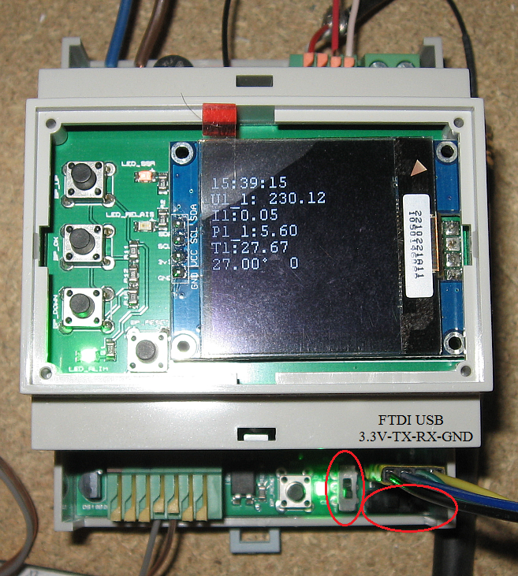
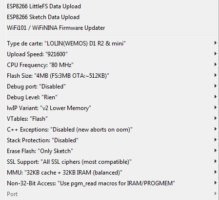
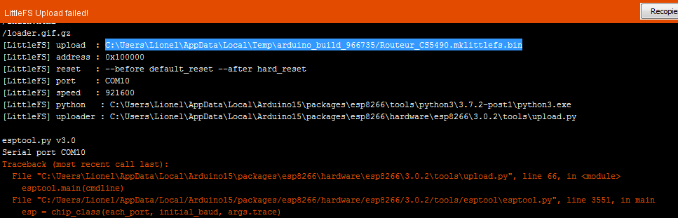
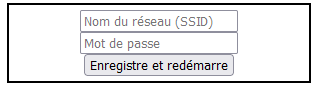

# Routeur Cirrus CS5490

---
### Pour le flash
- Mettre le switch vertical en haut (position flash)
- Mettre le switch horizontal à droite (position flash)
- Pour l'USB FTDI TTL, ne pas oublier que TX va sur RX et vice-versa 

 

---
### Pour le flash des pages web (FileSystem)
Les pages web (FileSystem) sont dans le dossier data. Pour les flasher au format LittleFS, on doit passer par Arduino car Sloeber n'a pas le bon plugin. 
Commencer par installer le plugin LittleFS dans Arduino : 
<a href="https://github.com/earlephilhower/arduino-esp8266littlefs-plugin">https://github.com/earlephilhower/arduino-esp8266littlefs-plugin</a> 
Une fois cela fait, redémarrer Arduino sur le projet Routeur_CS5490.ino. Vérifier que la configuration du type de carte est correcte (LOLIN(Wemos) D1 R2 & mini avec 4MB (FS:3MB) de flash) mais ne rien essayer de compiler, c'est juste pour que Arduino soit dans le bon dossier pour trouver le dossier Data.  
 

- Mettre les switch du routeur en position flash. 
- Menu Outils/"ESP8266 LittleFS Data Upload" 

Attendre la fin de l'upload (c'est assez long). 

Il est pratique d'avoir le fichier bin généré par Arduino. Pour cela, une astuce consiste à débrancher l'USB et d'essayer de faire l'upload. Il va faire une erreur de connexion. Il suffit alors de chercher dans le log la ligne commençant par "[LittleFS] upload". On a le chemin du fichier généré, genre C:\Users\Lionel\AppData\Local\Temp\arduino_build_966735/Routeur_CS5490.mklittlefs.bin 

 

---
### Pour le flash du bin (Firmware)
Dans Sloeber, menu Slober/"Upload Sketch" ou le bouton flèche bleu droite. 
Note : Si l'upload ne démarre pas, débrancher et rebrancher l'USB suffit généralement à réinitialiser la connexion.

---
### Séquence de démarrage 
Les étapes si on part de zéro sont :
- Le Routeur n'est pas alimenté en 230 V
- Mettre les switch en position flash, puis brancher l'USB FTDI TTL (l'adaptateur qui va bien !)
- upload des pages web (FileSystem)
- upload du bin (Firmware)
- débrancher l'USB remettre les switch en position normal
- Mettre le 230 V sur le routeur
- Ce dernier démarre et crée un Wifi local SoftAP "DefaultAP" avec l'adresse IP : 192.168.4.1
- Se connecter sur ce réseau Wifi "DefaultAP"
- Il affiche alors une toute petite page web permettant de renseigner son réseau Wifi avec le mot de passe 
 
- Valider, le routeur redémarre et affichera la nouvelle IP sur le réseau Wifi de la maison.
- Aller sur cette adresse IP pour avoir la page web du routeur. 

Au premier démarrage, le Routeur ne connait pas le réseau Wifi existant. Il crée donc un réseau local permettant de renseigner le SSID et le mot de passe du Wifi existant. Ces données sont stockées dans un fichier SSID.txt (à noter que l'accès à ce fichier est protégé). Si ce fichier est détruit, la procédure repart du début (l'appui pendant plus de 5 secondes sur le bouton du bas supprime ce fichier).

---
### Pour le flash à partir de la page web
Dans la page web "Config", le bouton "Flash ESP" permet de flasher le bin (Firmware) ou les datas (FileSystem : page web). On doit s'authentifier pour y accéder avec comme nom d'utilisateur "admin" et mot de passe "admin". 
Dans le cas ou l'on flashe les pages web, le routeur redémarrera sur son réseau local puisque toutes les datas ont été effacées. 
Note : l'upload est assez long, surtout le FileSystem (3 Mo) 

Dans le cas où on veut juste mettre à jour un fichier (par exemple le fichier index.html), il est plus rapide de passer par le bouton "Téléverser" qui permet de ne pas écraser tout le FileSystem. 

ATTENTION : Si un fichier existe en version "normale" et compressée (gz), le chargement de la page web se fera avec la version compressée. Il faut donc au minimum mettre à jour la version compressée ou bien la supprimer.
